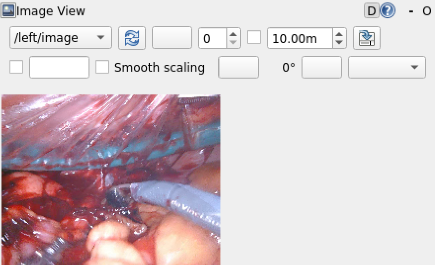

# stereo-vision-ros2


A ROS2 stereo vision pipeline built from scratch in Python, demonstrated on real da Vinci Xi surgical footage from the [StereoMIS](https://zenodo.org/records/8154924) dataset. Built as a personal portfolio project to develop hands-on expertise in stereo camera calibration, depth estimation, and ROS2 node architecture.

## Architecture

Three nodes in a single ROS2 package, `stereo_pipeline`:

```
┌────────────────┐        /left/image        ┌──────────────────┐
│                │ ────────────────────────► │                  │
│  fake_camera   │                            │    depth_node    │
│  (publisher)   │        /right/image        │  (subscriber,    │
│                │ ────────────────────────► │   ApproxTimeSync) │
└────────────────┘                            └──────────────────┘
                                                        │
                                                        ▼
                                            rectify → SGBM disparity
                                            → normalized depth map

┌────────────────────┐        /left/image, /right/image
│  calibration_node  │ ◄──────────────────────────────────────────
│  (skeleton)        │  collects checkerboard pairs, runs
│                     │  cv2.stereoCalibrate
└────────────────────┘
```

- **`fake_camera.py`** — Publisher node. Reads a StereoMIS video (vertically stacked stereo frames), splits each frame in half (top = left camera, bottom = right camera), converts each half to a ROS `sensor_msgs/Image` via `cv_bridge`, and publishes at 30 fps to `/left/image` and `/right/image`.
- **`depth_node.py`** — Core depth estimation node. Subscribes to `/left/image` and `/right/image` using `message_filters.ApproximateTimeSynchronizer` to guarantee matched stereo pairs. Loads stereo calibration (focal lengths, optical centers, distortion coefficients, rotation `R` and translation `T`) from `StereoCalibration.ini`. Runs `cv2.stereoRectify` and `cv2.initUndistortRectifyMap` once at startup to precompute rectification maps. On each synchronized pair: converts ROS messages to OpenCV arrays, rectifies with `cv2.remap`, converts to grayscale, and computes disparity with `StereoSGBM` (tuned `uniquenessRatio`, `speckleWindowSize`, `speckleRange`, `disp12MaxDiff`, `MODE_SGBM_3WAY`), then normalizes and displays the depth map.
- **`calibration_node.py`** — Skeleton node for running stereo calibration from live checkerboard images: detects checkerboard corners in synchronized pairs, refines them with `cornerSubPix`, and runs `cv2.stereoCalibrate` once enough pairs are collected. Demonstrates the same calibration skill built in the standalone scripts below, wired into the ROS2 node structure.

## Background

This pipeline builds on two earlier standalone OpenCV projects:

1. **Monocular camera calibration** — `findChessboardCorners`, `cornerSubPix`, `calibrateCamera`, `undistort`. Reprojection error: 0.26 (excellent).
2. **Stereo calibration + disparity** — `stereoCalibrate`, `stereoRectify`, `StereoSGBM` on a checkerboard dataset, producing working rectified stereo images and disparity maps.

This project moves that pipeline into a real ROS2 node architecture and tests it against real, in-vivo surgical footage rather than a lab checkerboard.

## Dataset

[StereoMIS](https://zenodo.org/records/8154924) (Hayoz & Allan, 2023) — da Vinci Xi surgical robot stereo endoscope footage, 11 sequences, in-vivo porcine subjects. Each sequence contains a vertically stacked stereo video and a `StereoCalibration.ini` with camera intrinsics and extrinsics.

> M. Hayoz and R. Allan, "StereoMIS," Zenodo, 2023. DOI: [10.5281/zenodo.8154924](https://doi.org/10.5281/zenodo.8154924)

### Getting the data

Download a sequence (e.g. `P1`) from the [StereoMIS Zenodo record](https://zenodo.org/records/8154924) and place its video and calibration file at:

```
~/stereo_ws/data/P1/video.mp4
~/stereo_ws/data/P1/StereoCalibration.ini
```

These paths are currently hardcoded in `fake_camera.py` and `depth_node.py` rather than exposed as ROS2 parameters — swapping sequences means editing those paths directly. Making them configurable (e.g. via a launch file / ROS parameters) is a natural follow-up.

## Results

The pipeline runs live at ~30 fps end to end: video replay → rectification → SGBM disparity → display. Calibration loading and rectification are correct — the rectified left/right images align properly.

The depth map itself is visually noisy. This is a known, documented limitation: classical block-matching stereo (SGBM) performs poorly on low-texture, specular surgical tissue. Texture-less regions and specular highlights from wet tissue surfaces cause high matching ambiguity between the left and right images, which is well established in the stereo endoscopy literature. The architecture and calibration pipeline are correct; the limiting factor is the algorithm class, not the implementation.

| Input (`/left/image`) | Disparity, default params | Disparity, tuned params |
|---|---|---|
|  |  |  |

Tuning `uniquenessRatio`, `speckleWindowSize`, and `speckleRange` reduces speckle noise somewhat, but doesn't fix the underlying problem: on wet, texture-less tissue, block matching has too little signal to work with.

**Honest limitations:**
- Classical SGBM fails on low-texture surgical tissue — specular highlights and uniform tissue surfaces create too many ambiguous pixel matches.
- The resulting depth map is semi-sparse and noisy on this dataset specifically.
- No ground truth depth is available for quantitative evaluation on StereoMIS.
- `fake_camera.py` replays pre-recorded video rather than subscribing to a live stereo camera.

## What I learned

- OpenCV camera calibration pipeline from scratch (intrinsics, distortion, reprojection error)
- Stereo geometry: baseline, rectification, epipolar lines, and the disparity-to-depth relationship `Z = (f × B) / d`
- `StereoSGBM` parameter tuning and what each parameter actually does
- ROS2 node architecture in Python (`rclpy`, publishers, subscribers, timers)
- `cv_bridge` for ROS `Image` ↔ OpenCV NumPy array conversion
- `message_filters.ApproximateTimeSynchronizer` for synchronized multi-topic subscriptions
- Reading stereo calibration parameters from `.ini` files with `configparser`
- The difference between self-persistent node state (calibration matrices, rectification maps, the stereo matcher) and per-frame local variables

## Next steps

- **Short term:** Add WLS (Weighted Least Squares) disparity post-filtering using `cv2.ximgproc.createDisparityWLSFilter` — a guided filter that uses edge information from the original image to smooth and fill the disparity map. This is a standard post-processing step in production stereo pipelines.
- **Medium term:** Replace SGBM with a learned stereo matcher. [RAFT-Stereo](https://arxiv.org/abs/2109.07547) (Lipson et al., 2021) and CREStereo are current state of the art on general benchmarks. For surgical scenes specifically, the StereoMIS authors use RAFT-based optical flow in their [robust-pose-estimator](https://github.com/aimi-lab/robust-pose-estimator), which handles deformable, low-texture tissue better than classical block matching.
- **Long term:** Use this stereo depth pipeline as the perception front-end for a visual odometry system — tracking feature motion between frames (`cv2.goodFeaturesToTrack` + `cv2.calcOpticalFlowPyrLK`), estimating camera motion, and publishing a trajectory as `nav_msgs/Path` in RViz. This is the foundation of SLAM.
- **Production path:** Complete `calibration_node.py` to subscribe to live camera topics, collect synchronized checkerboard pairs, run `stereoCalibrate`, and save results in ROS `camera_info` YAML format for downstream use.

## How to run

**Terminal 1 — depth node:**
```bash
cd ~/stereo_ws
colcon build --packages-select stereo_pipeline
source install/setup.bash
ros2 run stereo_pipeline depth_node
```

**Terminal 2 — fake camera (replays StereoMIS footage):**
```bash
source /opt/ros/humble/setup.bash
source ~/stereo_ws/install/setup.bash
ros2 run stereo_pipeline fake_camera
```

## License

MIT — see [LICENSE](LICENSE).
