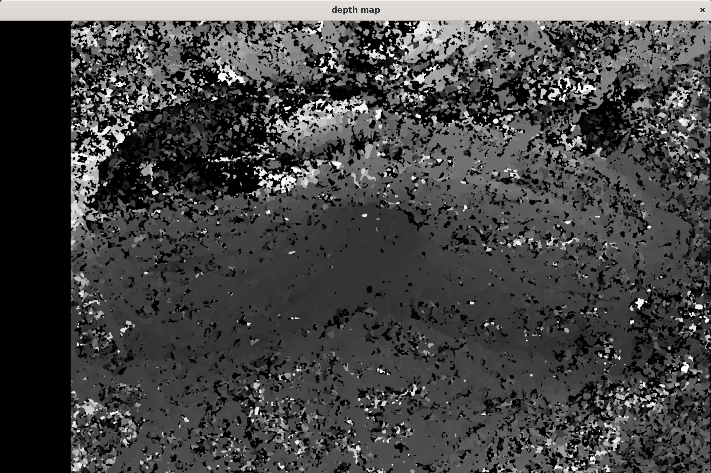
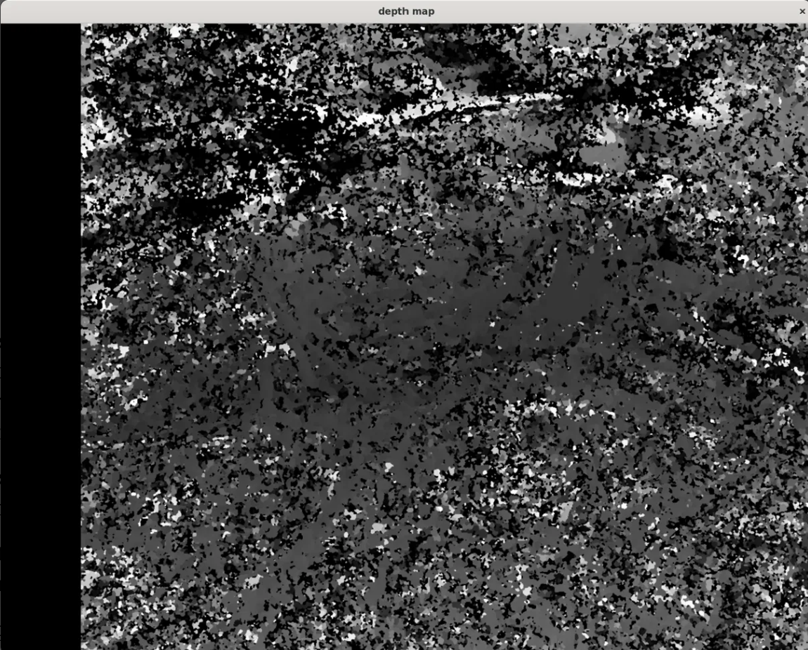
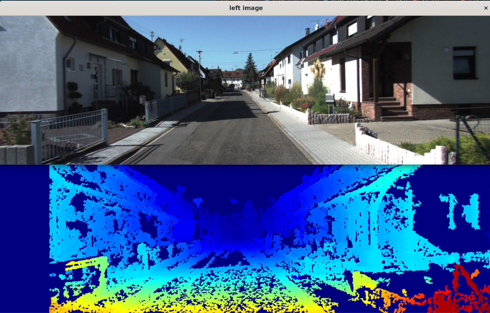
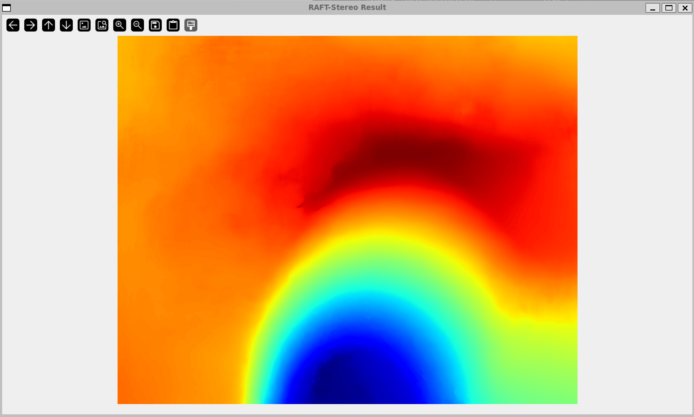

# stereo-vision-ros2


A ROS2 stereo vision pipeline built from scratch in Python, demonstrated on real da Vinci Xi surgical footage from the [StereoMIS](https://zenodo.org/records/8154924) dataset. Built as a personal portfolio project to develop hands-on expertise in stereo camera calibration, depth estimation, and ROS2 node architecture.

## Architecture

Three nodes in a single ROS2 package, `stereo_pipeline`:

```
┌────────────────┐        /left/image        ┌──────────────────┐
│                │ ────────────────────────► │                  │
│  fake_camera   │                            │    depth_node    │
│  (publisher)   │        /right/image        │  (subscriber,    │
│                │ ────────────────────────► │   ApproxTimeSync) │
└────────────────┘                            └──────────────────┘
                                                        │
                                                        ▼
                                            rectify → SGBM disparity
                                            → normalized depth map

┌────────────────────┐        /left/image, /right/image
│  calibration_node  │ ◄──────────────────────────────────────────
│  (skeleton)        │  collects checkerboard pairs, runs
│                     │  cv2.stereoCalibrate
└────────────────────┘
```

- **`fake_camera.py`** — Publisher node. Reads a StereoMIS video (vertically stacked stereo frames), splits each frame in half (top = left camera, bottom = right camera), converts each half to a ROS `sensor_msgs/Image` via `cv_bridge`, and publishes at 30 fps to `/left/image` and `/right/image`.
- **`depth_node.py`** — Core depth estimation node. Subscribes to `/left/image` and `/right/image` using `message_filters.ApproximateTimeSynchronizer` to guarantee matched stereo pairs. Loads stereo calibration (focal lengths, optical centers, distortion coefficients, rotation `R` and translation `T`) from `StereoCalibration.ini`. Runs `cv2.stereoRectify` and `cv2.initUndistortRectifyMap` once at startup to precompute rectification maps. On each synchronized pair: converts ROS messages to OpenCV arrays, rectifies with `cv2.remap`, converts to grayscale, and computes disparity with `StereoSGBM` (tuned `uniquenessRatio`, `speckleWindowSize`, `speckleRange`, `disp12MaxDiff`, `MODE_SGBM_3WAY`), then normalizes and displays the depth map.
- **`calibration_node.py`** — Skeleton node for running stereo calibration from live checkerboard images: detects checkerboard corners in synchronized pairs, refines them with `cornerSubPix`, and runs `cv2.stereoCalibrate` once enough pairs are collected. Demonstrates the same calibration skill built in the standalone scripts below, wired into the ROS2 node structure.

## Background

This pipeline builds on two earlier personal projects where I worked through OpenCV's stereo vision documentation from scratch to get comfortable with camera calibration and stereo geometry:

1. **Monocular camera calibration** — `findChessboardCorners`, `cornerSubPix`, `calibrateCamera`, `undistort`. Reprojection error: 0.26 (excellent).
2. **Stereo calibration + disparity** — `stereoCalibrate`, `stereoRectify`, `StereoSGBM` on a checkerboard dataset, producing working rectified stereo images and disparity maps.

This project moves that pipeline into a real ROS2 node architecture and tests it against real, in-vivo surgical footage rather than a lab checkerboard.

## Dataset

[StereoMIS](https://zenodo.org/records/8154924) (Hayoz & Allan, 2023) — da Vinci Xi surgical robot stereo endoscope footage, 11 sequences, in-vivo porcine subjects. Each sequence contains a vertically stacked stereo video and a `StereoCalibration.ini` with camera intrinsics and extrinsics.

> M. Hayoz and R. Allan, "StereoMIS," Zenodo, 2023. DOI: [10.5281/zenodo.8154924](https://doi.org/10.5281/zenodo.8154924)

### Getting the data

Download a sequence (e.g. `P1`) from the [StereoMIS Zenodo record](https://zenodo.org/records/8154924) and place its video and calibration file at:

```
~/stereo_ws/data/P1/video.mp4
~/stereo_ws/data/P1/StereoCalibration.ini
```

These paths are currently hardcoded in `fake_camera.py` and `depth_node.py` rather than exposed as ROS2 parameters — swapping sequences means editing those paths directly. Making them configurable (e.g. via a launch file / ROS parameters) is a natural follow-up.

## Results

The pipeline runs live at ~30 fps end to end: video replay → rectification → SGBM disparity → display. Calibration loading and rectification are correct — the rectified left/right images align properly.

The depth map itself is visually noisy. This is a known, documented limitation: classical block-matching stereo (SGBM) performs poorly on low-texture, specular surgical tissue. Texture-less regions and specular highlights from wet tissue surfaces cause high matching ambiguity between the left and right images, which is well established in the stereo endoscopy literature. The architecture and calibration pipeline are correct; the limiting factor is the algorithm class, not the implementation.

**Live `/left/image` topic** — the `fake_camera` node publishing da Vinci Xi surgical footage, viewed via `rqt_image_view`:


**Disparity, default SGBM parameters** (`blockSize=11`, everything else left at OpenCV defaults):



**Disparity, tuned SGBM parameters** (`blockSize=5`, `uniquenessRatio=10`, `speckleWindowSize=100`, `speckleRange=2`, `disp12MaxDiff=1`, `MODE_SGBM_3WAY`):



Tuning `uniquenessRatio`, `speckleWindowSize`, and `speckleRange` reduces speckle noise somewhat, but doesn't fix the underlying problem: on wet, texture-less tissue, block matching has too little signal to work with.

**Honest limitations:**
- Classical SGBM fails on low-texture surgical tissue — specular highlights and uniform tissue surfaces create too many ambiguous pixel matches.
- The resulting depth map is semi-sparse and noisy on this dataset specifically.
- No ground truth depth is available for quantitative evaluation on StereoMIS.
- `fake_camera.py` replays pre-recorded video rather than subscribing to a live stereo camera.

## KITTI Stereo 2012 Benchmark Results

To isolate whether the poor depth quality on StereoMIS comes from the pipeline or from the dataset, the exact same pipeline was also run on the [KITTI Stereo 2012](https://www.cvlibs.net/datasets/kitti/eval_stereo_flow.php?benchmark=stereo) benchmark — outdoor driving footage captured from a car-mounted stereo rig.



*Left: the left camera image from a KITTI driving scene. Right: the corresponding SGBM disparity map, JET colormap (warm colors = near, cool colors = far).*

`depth_node_kitti.py` uses the *exact same* `StereoSGBM` pipeline as `depth_node.py` — same parameters (`blockSize=5`, `uniquenessRatio=10`, `speckleWindowSize=100`, `speckleRange=2`, `disp12MaxDiff=1`, `MODE_SGBM_3WAY`), same algorithm, same code path from grayscale conversion through `stereo.compute()`. The only difference is that KITTI images arrive pre-rectified, so the `cv2.remap` rectification step is skipped entirely.

The result is a clean, dense, well-structured disparity map — a stark contrast to the noisy output on StereoMIS. This is the key evidence that the pipeline itself is architecturally sound: given a dataset with the right properties, unmodified SGBM produces good depth.

**Why KITTI works well with classical SGBM:**
- **Rich texture everywhere** — buildings, fences, road markings, vegetation. Block matching needs distinct pixel patterns to find correspondences, and outdoor driving scenes provide this in abundance.
- **Good lighting** — natural outdoor sunlight, no specular highlights.
- **Large baseline** — KITTI's stereo rig has a ~54 cm baseline, giving a strong disparity signal.
- **Static, rigid scene geometry** — buildings and roads don't deform between the left and right captures.

**Why StereoMIS (da Vinci surgical) performs poorly with the same algorithm:**
- **Low-texture tissue** — smooth, wet tissue surfaces have very few distinct features for block matching to lock onto.
- **Specular highlights** — wet tissue reflects the endoscope light, creating bright spots that shift unpredictably between the left and right views and confuse the matcher.
- **Small baseline** — the da Vinci stereo endoscope has a very narrow baseline (~4.4 mm, from the `T_0` value in the calibration file), producing tiny disparity differences that are much harder to resolve than KITTI's ~54 cm baseline.
- **Deformable scene** — tissue moves and deforms during surgery, unlike rigid outdoor scenes.

This isn't just an implementation quirk — it holds at the state-of-the-art level too. On the [KITTI 2012 leaderboard](https://www.cvlibs.net/datasets/kitti/eval_stereo_flow.php?benchmark=stereo), OpenCV's SGBM (`OCV-SGBM`, entry #262) achieves a 7.64% error rate at the 3px threshold, while current learned methods like IGEV-Stereo and CREStereo achieve under 1.2% — on the *same easy, textured, rigid* driving scenes. Classical block matching is already well behind learned methods on friendly data; on low-texture, deformable, specular surgical footage, that gap becomes the difference between a noisy-but-usable depth map and one that isn't. This is consistent with why the StereoMIS authors themselves moved to a RAFT-based learned approach (see [Next steps](#next-steps)) rather than classical stereo.

> A. Geiger, P. Lenz, and R. Urtasun, "Are we ready for Autonomous Driving? The KITTI Vision Benchmark Suite," CVPR 2012.

```bibtex
@inproceedings{Geiger2012CVPR,
  author = {Andreas Geiger and Philip Lenz and Raquel Urtasun},
  title = {Are we ready for Autonomous Driving? The KITTI Vision Benchmark Suite},
  booktitle = {Conference on Computer Vision and Pattern Recognition (CVPR)},
  year = {2012}
}
```

## Classical vs Learned Stereo Matching

The KITTI results above show that the pipeline itself is sound — the question left open is whether a *better matching algorithm* on the *same* StereoMIS surgical footage would close the gap. To find out, [RAFT-Stereo](https://arxiv.org/abs/2109.07547) (Lipson et al., 2021) was run on the identical da Vinci P1 frame used for the SGBM results above, using the authors' pretrained weights.

<table>
<tr>
<td align="center"><br><sub><b>StereoSGBM (classical block matching)</b></sub></td>
<td align="center"><br><sub><b>RAFT-Stereo (learned stereo matching, Lipson et al. 2021)</b></sub></td>
</tr>
</table>

*Same frame, same StereoMIS P1 da Vinci surgical footage that produced the noisy SGBM result above — only the matching algorithm changed.*

**What RAFT-Stereo is doing differently:** RAFT-Stereo is a deep learning stereo matching model that won Best Student Paper at 3DV 2021. Instead of matching raw pixel patches the way SGBM does, it uses a CNN to extract a learned feature descriptor for every pixel — a vector that encodes local texture, edges, and surrounding context, not just raw intensity. That's the key difference on tissue: two pixels on a uniform, texture-less surface can look identical in raw RGB but still get different feature vectors, because the network is encoding what's around them rather than just the pixel itself — directly addressing the ambiguity that breaks block matching. It then iteratively refines the disparity estimate with a recurrent unit (GRU), converging over 20+ iterations to a smooth, dense result instead of a single one-shot correlation lookup. No training was performed here — inference only, using the authors' pretrained `raftstereo-middlebury.pth` weights on an RTX 4060 Laptop GPU (~3.7s per frame).

This comparison is the core result of the project: the ROS2 pipeline architecture, calibration, and rectification were never the problem. Running the exact same StereoMIS frame through a learned matcher instead of SGBM, with everything else in the pipeline untouched, produces a dramatically cleaner depth map. The limiting factor on surgical tissue was always the algorithm class, not the implementation.

It also lines up with the state-of-the-art numbers cited above: on the [KITTI 2012 leaderboard](https://www.cvlibs.net/datasets/kitti/eval_stereo_flow.php?benchmark=stereo), OpenCV's SGBM (`OCV-SGBM`, entry #262) sits at 7.64% error, while learned methods including RAFT-Stereo and IGEV-Stereo are under 1.2% — nearly an order of magnitude better, even on KITTI's comparatively easy, well-textured driving scenes. On StereoMIS, where texture and lighting are working against the matcher instead of for it, that gap is exactly what's visible in the qualitative comparison above.

```bibtex
@inproceedings{lipson2021raft,
  title={RAFT-Stereo: Multilevel Recurrent Field Transforms for Stereo Matching},
  author={Lipson, Lahav and Teed, Zachary and Deng, Jia},
  booktitle={International Conference on 3D Vision (3DV)},
  year={2021}
}
```

## What I learned

- OpenCV camera calibration pipeline from scratch (intrinsics, distortion, reprojection error)
- Stereo geometry: baseline, rectification, epipolar lines, and the disparity-to-depth relationship `Z = (f × B) / d`
- `StereoSGBM` parameter tuning and what each parameter actually does
- ROS2 node architecture in Python (`rclpy`, publishers, subscribers, timers)
- `cv_bridge` for ROS `Image` ↔ OpenCV NumPy array conversion
- `message_filters.ApproximateTimeSynchronizer` for synchronized multi-topic subscriptions
- Reading stereo calibration parameters from `.ini` files with `configparser`
- The difference between self-persistent node state (calibration matrices, rectification maps, the stereo matcher) and per-frame local variables

## Next steps

- **Short term:** Add WLS (Weighted Least Squares) disparity post-filtering using `cv2.ximgproc.createDisparityWLSFilter` — a guided filter that uses edge information from the original image to smooth and fill the disparity map. This is a standard post-processing step in production stereo pipelines.
- **Medium term:** Replace SGBM with a learned stereo matcher. [RAFT-Stereo](https://arxiv.org/abs/2109.07547) (Lipson et al., 2021) and CREStereo are current state of the art on general benchmarks. For surgical scenes specifically, the StereoMIS authors use RAFT-based optical flow in their [robust-pose-estimator](https://github.com/aimi-lab/robust-pose-estimator), which handles deformable, low-texture tissue better than classical block matching.
- **Long term:** Use this stereo depth pipeline as the perception front-end for a visual odometry system — tracking feature motion between frames (`cv2.goodFeaturesToTrack` + `cv2.calcOpticalFlowPyrLK`), estimating camera motion, and publishing a trajectory as `nav_msgs/Path` in RViz. This is the foundation of SLAM.
- **Production path:** Complete `calibration_node.py` to subscribe to live camera topics, collect synchronized checkerboard pairs, run `stereoCalibrate`, and save results in ROS `camera_info` YAML format for downstream use.

## How to run

**Terminal 1 — depth node:**
```bash
cd ~/stereo_ws
colcon build --packages-select stereo_pipeline
source install/setup.bash
ros2 run stereo_pipeline depth_node
```

**Terminal 2 — fake camera (replays StereoMIS footage):**
```bash
source /opt/ros/humble/setup.bash
source ~/stereo_ws/install/setup.bash
ros2 run stereo_pipeline fake_camera
```

